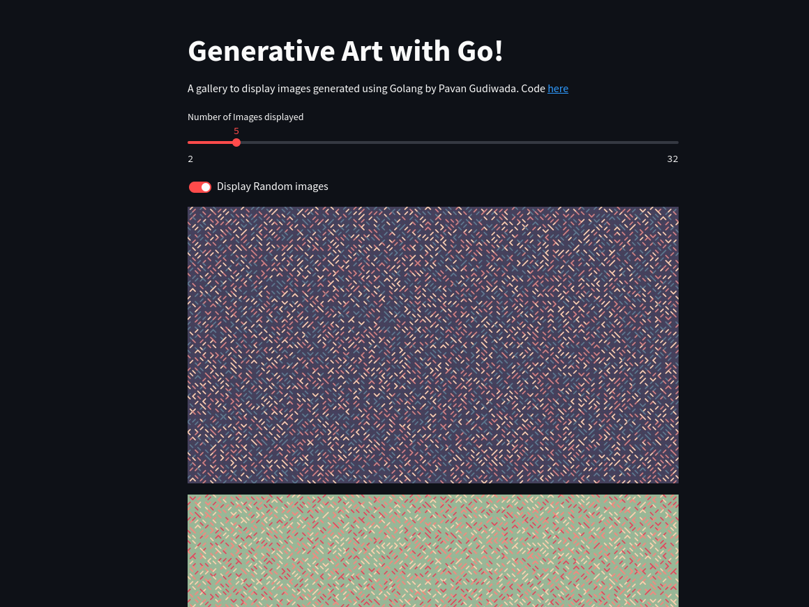

# Gallery App

## What is it?
This is a simple demo app built using Streamlit a Python library. The purpose of this app is to practice Python and also implement Cloud Native tools.

## Instructions

Follow these steps to build and deploy the application on your own Kubernetes cluster

### Clone the repository
Run
`git clone https://github.com/pavangudiwada/gallery-app.git`

### Build and deploy
The process is automated using a tool called Skaffold.

Run `skaffold run`. Skaffold builds the containers using Docker and deploys it to the Kubernetes cluster connected to your system.

### Access the application
Run `kubectl get nodes -o wide` to get the IP address of your node. 

Then go to `http://Node_IP:3007` to access the application.

## WIP 🏗️

## Tools Used
- Git
- Pyenv, virtualenv
- Python
    - Streamlit
    - Logging
    - OS
    - prometheus-client
- Poetry
- Skaffold
- Docker
- Kubernetes

## Git
- git init to initialize the project
- git add filename to add the file
- git commit -m "Message" to commit the added file.

## Pyenv & Virtualenv
- pyenv is used to create a virtual environment for local testing. It uses Python 3.11.5
- virtualenv was used to create a virtual environment based on Python 3.11.5

## Python
- Python version 3.11.5 is used with 
    1. Steamlit - A module to create webapplications without having to worry about HTML, CSS and JS
    2. OS - To get file paths
    3. Logging - To log things happening with the application
    4. Prometheus Client - Used to expose application metrics for Prometheus over /metrics/ endpoint.

## Poetry
- It's like pip, used to manage dependencies and packages.

## Skaffold
- Used to simplify building and deploying during developement. 

## Docker 
- Building and deploying application as containers

## Kubernetes 
- Deploying containers and for container orchestration